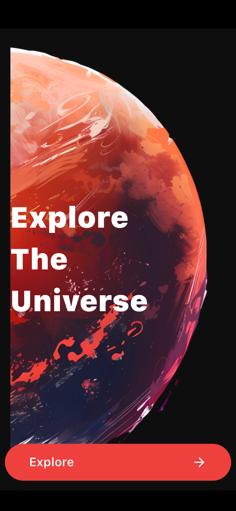
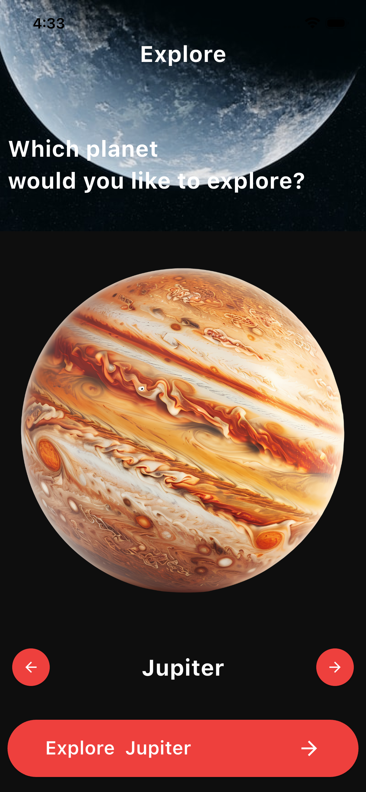
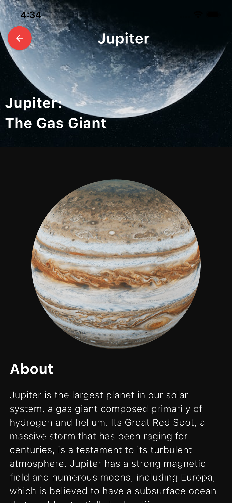

# Space App
## Description
A new Flutter project that allows users to explore and learn about space.

## Features
* Explore different planets and celestial bodies
* View images and information about each planet
* Interactive 3D models of planets and celestial bodies

## Technologies Used
* Flutter
* Dart
* Flutter 3D Controller

## Data Source
* All data used in the app is fetched from local assets files, including JSON files and images.
## Screenshots

  
  
  

## Installation
### Prerequisites
* Flutter installed on your machine
* Android Studio or Visual Studio Code

### Setup
1. Clone the repository using git clone
2. Open the project in Android Studio or Visual Studio Code
3. Run the project using flutter run

## Usage

1. Launch the app on your device or emulator
2. Tap on a planet to view its details
3. Use the 3D controller to interact with the planet's model

## Contributing
Contributions are welcome! If you'd like to contribute to the project, please fork the repository and submit a pull request.

## License
This project is licensed under the MIT License.
